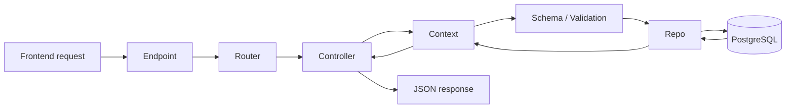
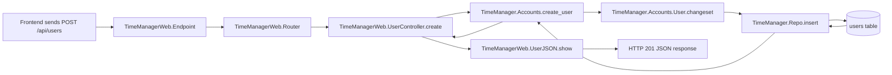
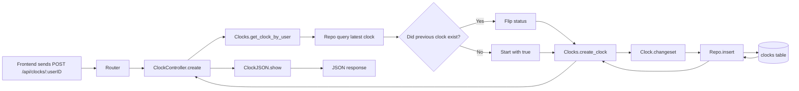
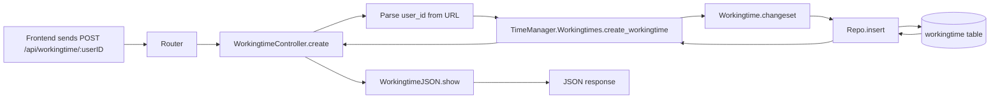

# Backend Overview

This document explains the backend architecture of the Time Manager Phoenix app in simple terms.

---

## 1. High-level idea

The backend is a Phoenix + Ecto application.

A typical request follows this pattern:



In plain language:

- the request enters the app
- the router matches the URL
- the controller handles the request
- the context does business logic
- the schema validates data
- the repo writes or reads the database
- the controller returns JSON to the frontend

---

## 2. The app starts here

### lib/time_manager/application.ex

This is the application startup file.

It starts:

- telemetry
- the database repo
- PubSub
- the Phoenix endpoint

This is the main boot file for the backend.

---

## 3. The database connection

### lib/time_manager/repo.ex

This file sets up Ecto to talk to PostgreSQL.

It is the connection between Elixir code and the database.

```elixir
defmodule TimeManager.Repo do
  use Ecto.Repo,
    otp_app: :time_manager,
    adapter: Ecto.Adapters.Postgres
end
```

This is the single access point for database operations.

---

## 4. The database files

The database tables are created in migration files under:

### priv/repo/migrations

The important migrations are:

- 20260922141401_create_users.exs
- 20260922141946_create_clocks.exs
- 20260922142347_create_workingtime.exs

These define the tables:

- `users`
- `clocks`
- `workingtime`

The migration creates the actual database structure.

---

## 5. Schemas: Elixir versions of database tables

### lib/time_manager/accounts/user.ex

This file defines the `users` schema.

It says a user has:

- `username`
- `email`
- timestamps

It also defines a `changeset`:

```elixir
def changeset(user, attrs) do
  user
  |> cast(attrs, [:username, :email])
  |> validate_required([:username, :email])
end
```

This validates incoming user data before it is saved.

### lib/time_manager/clocks/clock.ex

This defines the `clocks` schema.

It includes:

- `time`
- `status`
- `user_id`

### lib/time_manager/workingtimes/workingtime.ex

This defines the `workingtime` schema.

It includes:

- `start`
- `end`
- `user_id`

Pattern:

- migration = database table
- schema = Elixir representation of that table

---

## 6. Context modules: logic layer

The context files are the real “logic layer.”

### lib/time_manager/accounts.ex

This handles user-related logic:

- list users
- get a user
- create a user
- update a user
- delete a user
- change a user

Example:

```elixir
def create_user(attrs) do
  %User{}
  |> User.changeset(attrs)
  |> Repo.insert()
end
```

This is the actual create-user logic.

### lib/time_manager/clocks.ex

This handles clock operations.

Important behavior:

- look up the user’s latest clock
- decide whether the next clock is in or out
- create a record with a new status

Example from the controller flow:

```elixir
last_clock = Clocks.get_clock_by_user(user_id)
status = if last_clock, do: !last_clock.status, else: true
```

This is the “clock in / clock out” toggle logic.

### lib/time_manager/workingtimes.ex

This handles time intervals.

It can:

- list workingtime records for a user
- filter by start and end dates
- create workingtime entries
- update and delete workingtime entries

This is how the app stores work sessions or time blocks.

Pattern:

- context = application logic
- repo = DB updates
- schema = validation

---

## 7. The router: URL mapping

### lib/time_manager_web/router.ex

This file maps URLs to controller actions.

The important part is:

```elixir
scope "/api", TimeManagerWeb do
  pipe_through :api

  resources "/users", UserController, except: [:new, :edit]

  get "/workingtime/:userID", WorkingtimeController, :index
  get "/workingtime/:userID/:id", WorkingtimeController, :show
  post "/workingtime/:userID", WorkingtimeController, :create
  put "/workingtime/:id", WorkingtimeController, :update
  delete "/workingtime/:id", WorkingtimeController, :delete

  get "/clocks/:userID", ClockController, :show
  post "/clocks/:userID", ClockController, :create
end
```

This means:

- `/api/users` -> user routes
- `/api/clocks/:userID` -> clock routes
- `/api/workingtime/:userID` -> workingtime routes

---

## 8. Controllers: HTTP handlers

### lib/time_manager_web/controllers/user_controller.ex

This handles user requests.

It does:

- index
- create
- show
- update
- delete

### lib/time_manager_web/controllers/clock_controller.ex

This handles clock requests.

It has a special create flow:

- fetch latest clock for the user
- flip its `status`
- create a new clock record

### lib/time_manager_web/controllers/workingtime_controller.ex

This handles work interval requests.

It:

- reads route params
- adds `user_id` to the request body
- makes a workingtime record

Pattern:

- route matches URL
- controller reads params
- controller calls context
- context writes to database

---

## 9. JSON serializers

These files turn Ecto structs into JSON.

- lib/time_manager_web/controllers/user_json.ex
- lib/time_manager_web/controllers/clock_json.ex
- lib/time_manager_web/controllers/workingtime_json.ex

Example from user serializer:

```elixir
def show(%{user: user}) do
  %{data: data(user)}
end

defp data(%User{} = user) do
  %{
    id: user.id,
    username: user.username,
    email: user.email
  }
end
```

This ensures the frontend receives a clean JSON payload.

---

## 10. Error handling

### lib/time_manager_web/controllers/fallback_controller.ex

This catches errors like validation failures and not-found errors.

It converts them to proper API responses.

### lib/time_manager_web/controllers/changeset_json.ex

This formats validation errors from Ecto changesets.

### lib/time_manager_web/controllers/error_json.ex

This formats generic JSON errors.

Pattern:

- validation error -> 422
- not found -> 404
- controller fallback handles it

---

## 11. Request lifecycle example: creating a user

This is the full real example.



Actual file chain with input/output at each stage:

- user makes a request sends an api to endpoint.

1. lib/time_manager_web/endpoint.ex
   - Input: raw HTTP request with JSON
   - Output: parsed request forwarded to the router

2. lib/time_manager_web/router.ex
   - Input: `/api/users`
   - Output: route resolves to `UserController.create`

3. lib/time_manager_web/controllers/user_controller.ex
   - Input: `%{"user" => %{"username" => "jordan", "email" => "jordan@example.com"}}`
   - Output: calls `Accounts.create_user(user_params)`

4. lib/time_manager/accounts.ex
   - Input: `user_params`
   - Output: `%User{}` built and passed to `User.changeset` then `Repo.insert()`

5. lib/time_manager/accounts/user.ex
   - Input: `%{"username" => "jordan", "email" => "jordan@example.com"}`
   - Output: validated changeset or validation error

6. lib/time_manager/repo.ex
   - Input: valid changeset
   - Output: inserted row in PostgreSQL

7. priv/repo/migrations/20260922141401_create_users.exs
   - Input: migration run during setup
   - Output: `users` table exists with `username`, `email`, and timestamps

8. lib/time_manager_web/controllers/user_json.ex
   - Input: `%User{}` struct from the DB
   - Output: JSON payload shaped like `{ data: %{id, username, email} }`

Example request at the network boundary:

```json
{
  "user": {
    "username": "jordan",
    "email": "jordan@example.com"
  }
}
```

Example output at the end of the pipeline:

```json
{
  "data": {
    "id": 1,
    "username": "jordan",
    "email": "jordan@example.com"
  }
}
```

Example validation result if data is bad:

```json
{
  "errors": {
    "username": ["can't be blank"],
    "email": ["can't be blank"]
  }
}
```

---

## 12. Request lifecycle example: creating a clock



This is the important special behavior: the app is tracking current clock state, not just creating generic time entries.

Actual file chain with input/output at each stage:

1. lib/time_manager_web/endpoint.ex
   - Input: raw HTTP request with JSON body for a clock event
   - Output: parsed request forwarded to the router

2. lib/time_manager_web/router.ex
   - Input: `/api/clocks/42`
   - Output: route resolves to `ClockController.create`

3. lib/time_manager_web/controllers/clock_controller.ex
   - Input: `%{"userID" => "42"}`
   - Output: calls `Clocks.get_clock_by_user("42")`, builds `clock_params`, then calls `Clocks.create_clock(clock_params)`

4. lib/time_manager/clocks.ex
   - Input: `user_id = "42"`
   - Output: gets latest clock row for that user and decides next `status`

5. lib/time_manager/clocks/clock.ex
   - Input: `%{"time" => now, "status" => true, "user_id" => 42}`
   - Output: validated changeset or validation error

6. lib/time_manager/repo.ex
   - Input: valid changeset
   - Output: inserted row in PostgreSQL `clocks` table

7. priv/repo/migrations/20260922141946_create_clocks.exs
   - Input: migration run during setup
   - Output: `clocks` table exists with `time`, `status`, and `user_id`

8. lib/time_manager_web/controllers/clock_json.ex
   - Input: `%Clock{}` struct from the DB
   - Output: JSON payload shaped like `{ data: %{id, time, status} }`

Example request at the network boundary:

```json
{
  "userID": "42"
}
```

Example output at the end of the pipeline:

```json
{
  "data": {
    "id": 12,
    "time": "2026-10-03T13:00:00Z",
    "status": true
  }
}
```

Example validation result if data is bad:

```json
{
  "errors": {
    "time": ["can't be blank"],
    "status": ["can't be blank"],
    "user_id": ["can't be blank"]
  }
}
```

---

## 13. Request lifecycle example: creating a workingtime



This is how a work session or time interval is stored.

Actual file chain with input/output at each stage:

1. lib/time_manager_web/endpoint.ex
   - Input: raw HTTP request with JSON body containing a work interval
   - Output: parsed request forwarded to the router

2. lib/time_manager_web/router.ex
   - Input: `/api/workingtime/42`
   - Output: route resolves to `WorkingtimeController.create`

3. lib/time_manager_web/controllers/workingtime_controller.ex
   - Input: `%{"userID" => "42", "workingtime" => %{"start" => "2026-10-03T09:00:00Z", "end" => "2026-10-03T17:00:00Z"}}`
   - Output: adds `"user_id" => 42` and calls `Workingtimes.create_workingtime(workingtime_params)`

4. lib/time_manager/workingtimes.ex
   - Input: `%{"start" => "...", "end" => "...", "user_id" => 42}`
   - Output: `%Workingtime{}` built and passed to `Workingtime.changeset` then `Repo.insert()`

5. lib/time_manager/workingtimes/workingtime.ex
   - Input: `%{"start" => "2026-10-03T09:00:00Z", "end" => "2026-10-03T17:00:00Z", "user_id" => 42}`
   - Output: validated changeset or validation error

6. lib/time_manager/repo.ex
   - Input: valid changeset
   - Output: inserted row in PostgreSQL `workingtime` table

7. priv/repo/migrations/20260922142347_create_workingtime.exs
   - Input: migration run during setup
   - Output: `workingtime` table exists with `start`, `end`, and `user_id`

8. lib/time_manager_web/controllers/workingtime_json.ex
   - Input: `%Workingtime{}` struct from the DB
   - Output: JSON payload shaped like `{ data: %{id, start, end} }`

Example request at the network boundary:

```json
{
  "workingtime": {
    "start": "2026-10-03T09:00:00Z",
    "end": "2026-10-03T17:00:00Z"
  }
}
```

Example output at the end of the pipeline:

```json
{
  "data": {
    "id": 7,
    "start": "2026-10-03T09:00:00Z",
    "end": "2026-10-03T17:00:00Z"
  }
}
```

Example validation result if data is bad:

```json
{
  "errors": {
    "start": ["can't be blank"],
    "end": ["can't be blank"],
    "user_id": ["can't be blank"]
  }
}
```

---

## 14. The overall pattern in one sentence

The backend follows the standard Phoenix pattern:

- route -> controller -> context -> schema -> repo -> database
- then response is serialized back as JSON

That is the core architecture of this project.

---

## 15. Best files to remember

If you only remember a few files, remember these:

- lib/time_manager/application.ex
- lib/time_manager/repo.ex
- lib/time_manager/accounts.ex
- lib/time_manager/clocks.ex
- lib/time_manager/workingtimes.ex
- lib/time_manager_web/router.ex
- lib/time_manager_web/controllers/user_controller.ex
- lib/time_manager_web/controllers/clock_controller.ex
- lib/time_manager_web/controllers/workingtime_controller.ex
- priv/repo/migrations

---

## 16. Final takeaway

This project is not just “random files.”

It follows a very consistent structure:

- every resource has a schema
- every resource has a context
- every resource has a controller
- every resource is stored in Postgres
- every response is serialized as JSON

That is the key pattern to understand in this backend.
