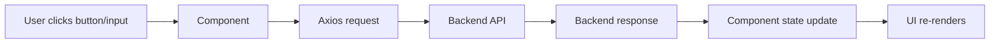
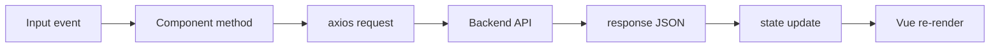

# Frontend Overview

This document explains the frontend architecture of the Time Manager Vue app in simple terms.

---

## 1. High-level idea

The frontend is a Vue 3 app built with Vite.

A typical interaction follows this pattern:



In plain language:

- the user interacts with the page
- a Vue component captures the event
- the component calls the backend with `axios`
- the backend responds with JSON
- the component updates local state
- Vue re-renders the screen

---

## 2. App entry point

### src/main.js

This is the Vue application entry file.

```js
import './assets/main.css'

import { createApp } from 'vue'
import App from './App.vue'

createApp(App).mount('#app')
```

This does three important things:

- imports the CSS
- creates the Vue app
- mounts it into the page (`#app`)

This is where the app actually starts.

---

## 3. App shell

### src/App.vue

This is the top-level parent component.

It is responsible for:

- rendering the main widgets
- storing the current selected user ID
- passing that user ID into child components

```vue
<script>
import User from './components/User.vue'
import WorkingTimes from './components/WorkingTimes.vue'
import WorkingTime from './components/WorkingTime.vue'
import ClockManager from './components/ClockManager.vue'
import ChartManager from './components/ChartManager.vue'

export default {
  components: {
    User,
    WorkingTimes,
    WorkingTime,
    ClockManager,
    ChartManager
  },

  data() {
    return {
      currentUserId: null
    }
  },

  methods: {
    changeUser(userId) {
      this.currentUserId = userId
    }
  }
}
</script>
```

And it renders the following parts:

- `User`
- `ClockManager`
- `WorkingTimes`
- `WorkingTime`
- `ChartManager`

This is the main screen assembly point.

---

## 4. Component structure

### src/components/User.vue

This component manages user creation, reading, updating, and deletion.

It contains:

- a user ID input
- a username input
- an email input
- buttons for get/create/update/delete

It calls the backend using `axios`:

- `GET /api/users/:id`
- `POST /api/users`
- `PUT /api/users/:id`
- `DELETE /api/users/:id`

When the user is loaded or created, it emits:

```js
this.$emit("userChanged", this.userId)
```

That tells the parent `App.vue` to update `currentUserId`.

---

### src/components/ClockManager.vue

This component manages the current clock state for a selected user.

It shows:

- whether the user is clocked in or out
- the current start time
- buttons for refresh and clock in/out

It calls the backend:

- `GET /api/clocks/:userId`
- `POST /api/clocks/:userId`
- then sometimes `POST /api/workingtime/:userId` when clocking out

This is the special feature of the frontend: it stores a local clock state and uses the backend to toggle it.

---

### src/components/WorkingTimes.vue

This component lists all working-time records for a selected user.

It calls:

- `GET /api/workingtime/:userId`

Then it stores the response in:

```js
workingTimes: []
```

and displays each item in the UI.

---

### src/components/WorkingTime.vue

This component lets the user create or update a working-time entry manually.

It contains:

- working time ID
- start time input
- end time input
- create/update/delete buttons

It calls:

- `POST /api/workingtime/:userId`
- `PUT /api/workingtime/:id`
- `DELETE /api/workingtime/:id`

---

### src/components/ChartManager.vue

This component loads the working-time data and turns it into charts.

It uses:

- `axios` to fetch the working times
- `vue-chartjs`
- `chart.js`

It creates charts for:

- hours worked
- hours over time
- work sessions

---

## 5. Data flow pattern

The frontend follows one main pattern:



The state is stored in component `data()` and updated via methods.

Example:

```js
data() {
  return {
    userId: null,
    username: "",
    email: ""
  }
}
```

Then after a successful API response, the component updates those values.

---

## 6. Actual file chain: creating a user from the frontend

This is the real flow for a user creation action.

### Actual file chain with input/output at each stage

1. src/main.js
   - Input: app boots with `createApp(App).mount('#app')`
   - Output: Vue app rendered on the page

2. src/App.vue
   - Input: parent app state with `currentUserId`
   - Output: renders `User` and passes `currentUserId` into child components

3. src/components/User.vue
   - Input: user form values (`username`, `email`)
   - Output: `createUser()` calls `axios.post('/api/users', ...)`

4. axios request
   - Input: `{ user: { username: 'jordan', email: 'jordan@example.com' } }`
   - Output: HTTP request to the backend API route `/api/users`

5. backend response
   - Input: response JSON from backend
   - Output: `response.data.data.id` is assigned to `this.userId`

6. App.vue parent update
   - Input: emitted event `userChanged`
   - Output: `currentUserId` is updated

7. other components re-render
   - Input: new `userId`
   - Output: `ClockManager`, `WorkingTimes`, `WorkingTime`, and `ChartManager` now react to the selected user

Example request sent by the frontend:

```js
axios.post('/api/users', {
  user: {
    username: 'jordan',
    email: 'jordan@example.com'
  }
})
```

Example backend response received by the frontend:

```json
{
  "data": {
    "id": 1,
    "username": "jordan",
    "email": "jordan@example.com"
  }
}
```

Example local UI state update after the response:

```js
this.userId = response.data.data.id
this.$emit('userChanged', this.userId)
```

---

## 7. Actual file chain: clocking in/out from the frontend

### Actual file chain with input/output at each stage

1. src/App.vue
   - Input: selected `currentUserId`
   - Output: passes `userId` to `ClockManager`

2. src/components/ClockManager.vue
   - Input: button click (`Clock In` or `Clock Out`)
   - Output: calls `axios.get('/api/clocks/:userId')` or `axios.post('/api/clocks/:userId')`

3. backend clock endpoint
   - Input: request for a user's latest clock status
   - Output: returns the current clock state

4. local state update
   - Input: `response.data.data.status`
   - Output: updates `clockIn` and `startDateTime`

5. when clocking out
   - Input: `startDateTime` and current time
   - Output: POST to `/api/workingtime/:userId` with `{ start, end }`

Example request when clocking out:

```js
axios.post(`/api/workingtime/${this.userId}`, {
  workingtime: {
    start: startTime,
    end: endTime
  }
})
```

Example backend response after a successful clock-in/out cycle:

```json
{
  "data": {
    "id": 10,
    "time": "2026-10-03T13:00:00Z",
    "status": true
  }
}
```

---

## 8. Actual file chain: loading working times and charts

### Actual file chain with input/output at each stage

1. src/App.vue
   - Input: current selected user
   - Output: passes the selected `userId` to `ChartManager`

2. src/components/ChartManager.vue
   - Input: user clicks `Load Charts`
   - Output: calls `axios.get('/api/workingtime/:userId')`

3. backend API
   - Input: request for time entries for the user
   - Output: JSON array of work sessions

4. ChartManager.js
   - Input: `response.data.data`
   - Output: converts timestamps into `labels` and `hours` arrays

5. chart props update
   - Input: `barData`, `lineData`, `pieData`
   - Output: Vue chart components render the chart visuals

Example request:

```js
axios.get(`/api/workingtime/${this.userId}`)
```

Example backend response:

```json
{
  "data": [
    {
      "id": 1,
      "start": "2026-10-03T09:00:00Z",
      "end": "2026-10-03T17:00:00Z"
    }
  ]
}
```

Example frontend transformation:

```js
const hours = workingTimes.map((item) => {
  const start = new Date(item.start)
  const end = new Date(item.end)
  return (end - start) / 3600000
})
```

---

## 9. The overall pattern in one sentence

The frontend follows this pattern:

- component UI event -> `axios` request -> backend API -> response data -> local state -> Vue re-render

That is the core architecture of this frontend app.

---

## 10. Best files to remember

If you only remember a few frontend files, remember these:

- src/main.js
- src/App.vue
- src/components/User.vue
- src/components/ClockManager.vue
- src/components/WorkingTimes.vue
- src/components/WorkingTime.vue
- src/components/ChartManager.vue
- package.json

---

## 11. Final takeaway

This frontend app is a thin UI layer over the backend API.

It does not directly talk to the database.

It does this instead:

- user interaction triggers a component method
- axios sends the request to the Phoenix backend
- backend response updates Vue state
- UI re-renders to show the latest result

That is the main pattern to understand in this frontend project.
